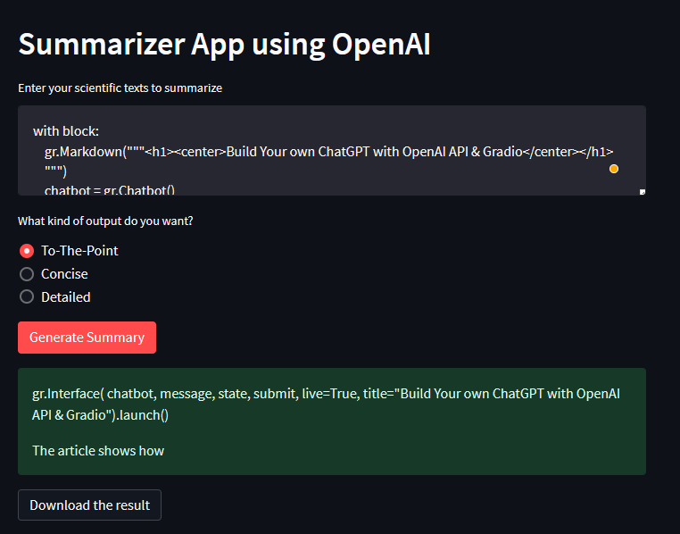

# Streamlit Apps
A repository that exhibits my experiments with Streamlit and OpenAI library of Python.\
Streamlit turns data scripts into shareable web apps in minutes.\
All in pure Python. No front‑end experience required.

**NOTE: This repository is created to enhanace my knowledge and share my experience with Streamlit!!!**

## 1) Summarizer App
This App is built using the OpenAI APIs. Streamlit gives front end look to the dull python code for this summarizer. I have used Davinci-003 engine to summarize the text. The user can also download the text once it's summarized. The text input should be greater than 100 words.

## 2) Basic ChatBot
